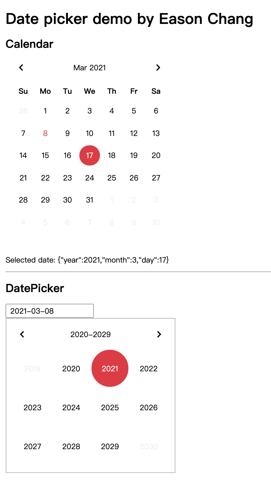

# react-datepicker

My custom react datepicker component

作者: Eason Chang



Live Demo: https://www.easonchang.com/react-datepicker/

Repo: https://github.com/Kamigami55/react-datepicker

## 成果

- 可選擇並顯示日期的 Calendar 元件
- 可鍵盤輸入或用 Calendar 選日期的 DatePicker input
- 包含一個 DemoPage

## 技術重點

- React.js 專用
- 自建專案架構，使用 Parcel.js 和 Babel
- RWD，支援手機版
- styled-components 注入 CSS 樣式
- 使用 [Atomic Design](https://bradfrost.com/blog/post/atomic-web-design/) 模式來分類元件
- 使用 [Hygen](http://www.hygen.io/) code generator 來生成元件檔案架構，加速開發
- eslint, prettier, stylelint 統一程式碼風格

## 專案架構

- _templates：hygen 模板（for code generating）
- src
  - components：按照 Atomic Design 模式分類元件
    - atoms：基礎元件（按鈕等）
    - molecules：複合元件（Header 等）
    - organisms：完整功能元件
      - Calendar
      - DatePicker
    - templates
      - DemoPageTemplate：Demo 頁樣式
    - pages
      - DemoPage：Demo 頁功能
  - constants
  - utils

## Local 啟動方法

```bash
yarn start
# or
npm start
```
